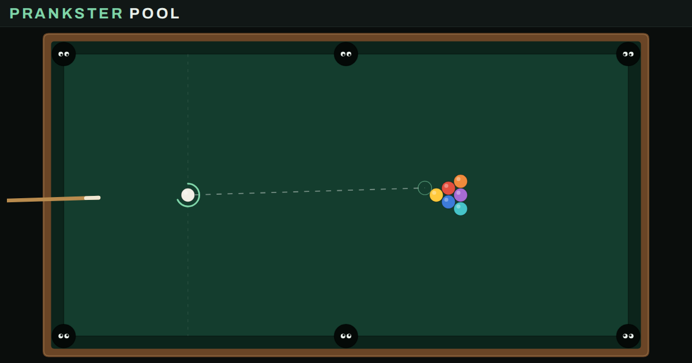

# Prankster Pool

A perfectly normal game of pool. Well… almost.

**Play it: https://quick-eyed-sky.github.io/Billiard/** (once GitHub Pages is switched on, see below)



A top-down pool table with 22 *mutations* you can switch on at any time, one at a time or all together: balls that yo-yo, pockets that slide away when a ball comes near, a referee who tells you nothing happened, a VCR that rewinds your best shot.

It isn't a game you win. It's a toy you show people. The idea comes from a pool game seen on an Apple II in 1987, where the fun wasn't winning but finding out how far the programmers had gone, with several people crowded around one screen.

## Playing

- **Shoot**: press near the white ball, pull back, let go. The green ring shows the power. A plain tap never fires a shot.
- **Mutations**: click the chips. Any combination works, even all 22 at once.
- **Cheat: see the future**: plays your shot ahead of time, every mutation included, and draws where every ball will go. It is never wrong.
- **Replay**: the last shot again, in slow motion.
- **So when does it go in, then?**: stops the nonsense and sends every coloured ball into a pocket.
- **Surprise**: each shot gets a random hidden mutation, named once the balls stop. Collect all 22 (your browser remembers the ones you found).
- **Prank a friend**: builds a link to a table that looks perfectly normal. Your friend's first shot is normal, then the pranks you picked kick in, quietly. After a while a *Wait… is this normal?* button appears, and the reveal tells them who pranked them and how many shots they lasted.

It works with a mouse or a finger. On a phone held upright, the table turns upright too.

## The 22 mutations

| Mutation | What it does |
| --- | --- |
| Yo-yo | Every 0.85 s the ball turns back the way it came. |
| Stubborn Ball | One ball flatly refuses to move. |
| Inflation | Every collision makes both balls bigger, until they no longer fit in the pockets. |
| Wraparound | No more bouncing: the ball goes through the cushion and comes back in on the other side. |
| Solar System | One ball becomes a star and pulls all the others in. |
| Zigzag | The ball swerves in rhythm: right, then left. |
| Crooked Cushions | Every bounce off a cushion comes out a few degrees wrong. |
| Mitosis | Any collision can split a ball in two, up to 16 on the table. |
| Ice Rink | The cloth hardly slows the balls down at all. |
| Lying Line | The aiming line promises a path that the ball does not follow. |
| Shy Pockets | When a ball comes close, the pocket slides away along the rail, and keeps an eye on it. |
| Indigestion | Each pocket spits out the first ball it swallows, then every other one. |
| Wormhole | Two swirls in the cloth: in through the blue one, out through the orange one, and back. |
| Seasick | The table is on a boat: after each shot everything slides from side to side, then the swell dies down. |
| Scaredy Balls | The balls are afraid of the white one: they tremble when it comes near, and back away. |
| Tipsy Cue | The cue sways while you aim; the shot goes wherever it points when you let go. |
| Pinball | Three bumpers on the cloth. Ding, +100, and it counts for nothing. |
| Firecrackers | A hard hit makes the balls around it blow apart. |
| Shady Referee | A referee comments on every shot. Always wrong, always sure of it. |
| VCR | Every other shot rewinds itself once the balls stop. Nothing happened. |
| Telekinesis | While the balls roll, hold your finger (or the mouse button) on the cloth: they come to you. |
| Ghost Ball | One ball turns into a ghost: while it moves fast, it passes straight through the others. |

## Putting it online

The game is a single web page, so GitHub can host it for free:

1. In this repository, open **Settings → Pages**.
2. Under **Build and deployment**, set **Source** to *Deploy from a branch*, pick **main** and **/ (root)**, then **Save**.
3. A minute later the game is live at https://quick-eyed-sky.github.io/Billiard/.

The links the game builds, and the preview card that messaging apps show (`preview.png`), point to that address.

### Links you can write by hand

- `#m=<code>` opens the table with some mutations switched on, in plain sight.
- `#p=<code>&from=<name>` is a prank link. `#p=0` lets chance pick two pranks.

`<code>` is a base-36 number whose bits are the mutations' `bit` values (see `MUTATIONS` in `index.html`). For example `#m=1` is Yo-yo alone and `#m=sh` is Yo-yo plus Shy Pockets.

## How it's made

- **One file.** `index.html` holds everything: plain JavaScript and Canvas 2D, no build step, no dependencies apart from two Google Fonts (with fallbacks). Double-click it and it runs, offline too.
- **A fixed clock.** The physics runs 360 steps per second on every screen, and all its randomness comes from a seeded generator stored in the game state. A copy of the state therefore plays a shot exactly the same way, to the bit. That is what lets **Cheat** draw the true future and **Replay** show the very same shot again.
- **Mutations are objects in a list.** Each entry of `MUTATIONS` has a name, a tooltip and one or more hooks: `force` (push a ball before it moves), `wall` and `bounce` (cushions), `hit`, `solid` and `rest` (collisions), `pocket`, `pre` and `post` (once per step), `draw`, `aim` and `end`. Cheat, Replay, Surprise and the prank links pick up a new mutation without any other change.
- **Never change or reuse a mutation's `bit`**: shared links are built from them. A new mutation takes the next number.

Adding one looks like this:

```js
{ id:'headwind', bit:22, name:"Headwind",
  tip:"A steady wind blows across the table.",
  force: function(W, b, h){ b.vy += 700*h; } }
```

### For the curious

The game can be driven from the browser console through `window.prankster`, for example `prankster.toggle('yoyo', true)`, `prankster.shoot(1800, 0)` or `prankster.future(1800, 0)`.
